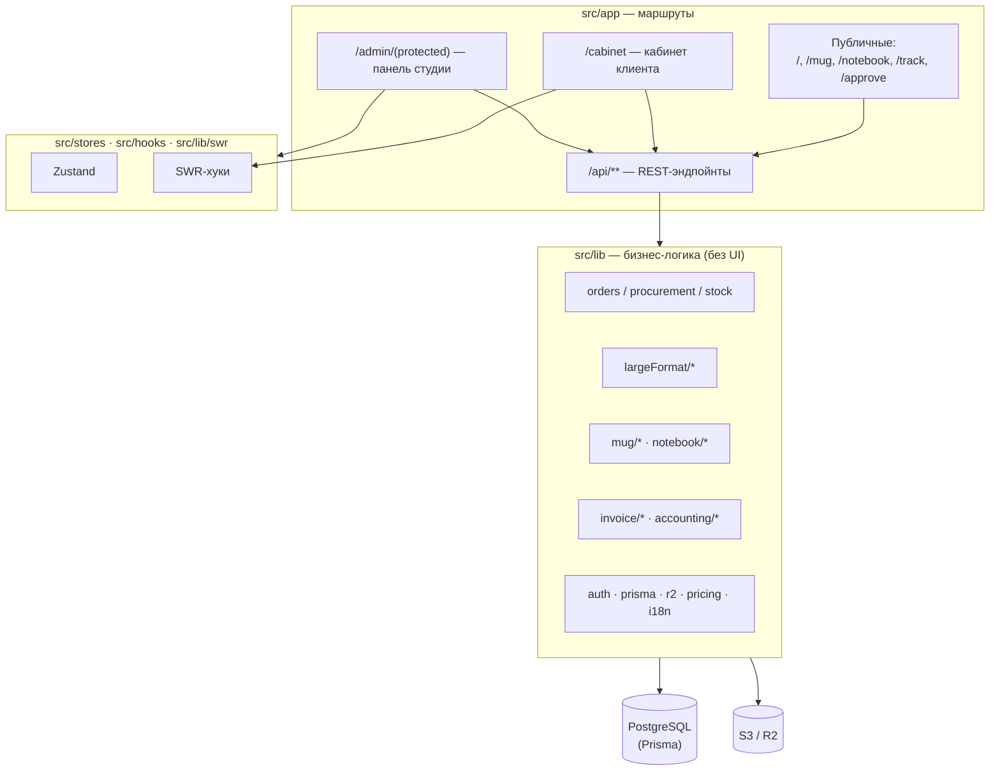
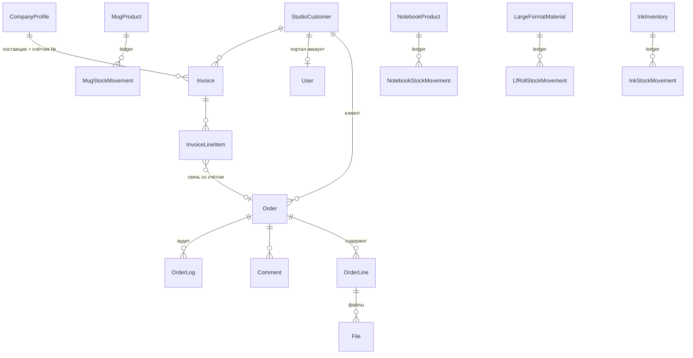

# Анализ приложения «Print Upload System» (anvi-uploader)

> Дата анализа: 2026-06-29 · Ветка: `main` · ~70 000 строк TS/TSX, 414 файлов, 47 миграций Prisma
>
> Цель документа — зафиксировать текущее состояние структуры, архитектуры и
> бизнес-логики, чтобы на его основе выбрать фокус для следующих шагов.

---

## 1. Краткое резюме (TL;DR)

Изначально проект задумывался как простой MVP — «загрузка файлов на печать + дашборд
оператора» (см. [README.md](README.md)). Фактически он вырос в **полноценную ERP-систему
для типографии / print-студии** со следующими подсистемами:

- Приём и обработка заказов (4 типа продукции).
- Дизайн-редакторы кружек и блокнотов (2D canvas + 3D-превью на Three.js).
- Широкоформатная печать (раскладка по рулону, упаковка плиток, генерация печатных PDF).
- Производственная доска (workshop board) с группировкой и раскладкой на рулон.
- Складской учёт с FIFO-докупкой (кружки, блокноты, чернила, рулоны).
- Выставление счетов «Cont spre plata» с НДС и атомарной нумерацией + PDF.
- Бухгалтерия / расчёт прибыли (COGS, производственные затраты, аллокация расходов).
- Личный кабинет клиента (cabinet) с дилерским ценообразованием.
- Реестр клиентов (CRM), роли, мультиязычность (RO/RU/EN).

**Главный вывод:** архитектура зрелая и продуманная (чистый слой `src/lib`, фиксация
снапшотов, аудит, тесты на бизнес-логику), но в UI-слое накопились **«файлы-монолиты»**
(до 3 277 строк), а документация (`README.md`) сильно отстала от реальности.

---

## 2. Технологический стек

| Слой | Технологии |
|------|------------|
| Framework | Next.js 16.2 (App Router, RSC), React 19 |
| Язык | TypeScript 5 (`strict: true`) |
| Стили | Tailwind CSS v4, Radix UI, `class-variance-authority` |
| Состояние | Zustand 5 (админ), SWR 2 (кабинет/каталоги), React Hook Form + Zod 4 |
| БД / ORM | PostgreSQL + Prisma 5.22 (НЕ v7 — нужен встроенный query engine) |
| Файлы | AWS S3 / Cloudflare R2 (presigned URL), локально — `.local-uploads` |
| 3D | three.js, `@react-three/fiber`, `@react-three/drei` (GLB-модели) |
| PDF / графика | `pdf-lib`, `@react-pdf/renderer` (счета), `sharp`, `pdfjs-dist` |
| Тесты | Vitest (unit + integration), Playwright (e2e) — 59 unit-файлов |
| Деплой | Vercel (регион `fra1`), Neon/Render PostgreSQL, cron очистки корзины |

### Конфигурация, на которую стоит обратить внимание
- [vercel.json](vercel.json): все API-функции с `maxDuration: 300`, прибиты к `fra1`
  (рядом с БД Neon для латентности — см. историю коммитов про perf).
- [next.config.ts](next.config.ts): `serverExternalPackages: ["@prisma/client"]`.
- [src/lib/prisma.ts](src/lib/prisma.ts): singleton с `PRISMA_CLIENT_EPOCH` на `globalThis`
  (защита от устаревшего клиента в dev) — важная нетривиальная деталь из `AGENTS.md`.

---

## 3. Структура проекта (верхний уровень)

Ключевые директории:
- `src/app/` — маршруты (публичные, `/cabinet`, `/admin/(protected)`, `/api`). ~90 API-роутов.
- `src/lib/` — **вся бизнес-логика вынесена из роутов** (хорошая практика): `orders`,
  `largeFormat`, `mug`, `notebook`, `invoice`, `accounting`, `ink`, `workshopBoard`.
- `src/stores/` — Zustand: `useOrdersStore` (главный, 17 КБ), `useWorkshopBoardStore`, `useTrashStore`, `useLanguageStore`.
- `src/lib/swr/` — ~16 SWR-хуков для каталогов, счетов, кабинета.
- `src/lib/i18n/` — три языка, ~1 400 строк типов ключей (RO по умолчанию).

---

## 4. Модель данных

23 модели Prisma. Условно делятся на 5 групп.

- **Заказы:** `Order` (шапка + денормализованные поля), `OrderLine` (1 строка = 1 блок
  продукции, `sortOrder`), `File` (привязан и к `orderId`, и к `orderLineId`).
- **Каталог + склад:** `MugProduct`, `NotebookProduct`, `LargeFormatMaterial`
  (+ `LfMaterialSizePreset`, прайс-лист размеров), `InkInventory`. У каждого — таблица
  движений (`*StockMovement`) как **аудит-леджер** и приходы (`*Receipt`).
- **Финансы:** `CompanyProfile` (синглтон-поставщик + атомарный `invoiceCounter`),
  `Invoice` + `InvoiceLineItem`, `AccountingSettings` (синглтон), `BusinessExpense`.
- **CRM / доступ:** `StudioCustomer` (таблица `clients`!), `User`, `Session`.
- **Прочее:** `Comment`, `CommentRead`, `OrderLog`.

### Архитектурные приёмы в модели
- **«Замороженные» снапшоты** (`mugProductSnapshot`, `notebookProductSnapshot`,
  `largeFormatLineData`, `supplierSnapshot`/`clientSnapshot` в счетах) — изменения в
  каталоге/реестре не меняют уже оформленные заказы и счета. **Это сильная сторона.**
- **Денормализация на `Order`** (productType, mug/notebook-поля) для быстрых списков;
  значение `"mixed"` для многострочных заказов ([computeOrderProductType.ts](src/lib/computeOrderProductType.ts)).
- **Деньги:** `Decimal(12,2)` MDL; единый Zod-`mdlPriceSchema` (макс. 2 знака).
- **Soft delete:** `deletedAt` + богатый набор индексов под фактические запросы списков.
- **Именование:** модель CRM называется `StudioCustomer` (а не `Client`) намеренно —
  чтобы делегат `prisma.client` не путали с `PrismaClient` (был баг с `undefined.findFirst`).

---

## 5. Бизнес-логика по доменам

### 5.1 Жизненный цикл заказа
Статусы ([validations.ts](src/lib/validations.ts)):
`NEW → IN_PROGRESS → READY_IN_STUDIO → SENT_TO_WORKSHOP → WORKSHOP_PRINTING →
WORKSHOP_READY → RETURNED_TO_STUDIO → DELIVERED` (+ `ISSUE` в любой момент).

- **Нет серверного графа переходов** — допускается любой валидный статус; ограничения
  только ролевые. Это упрощает код, но не защищает от «нелогичных» переходов.
- Побочные эффекты в [api/orders/[id]/route.ts](src/app/api/orders/[id]/route.ts):
  смена статуса проставляет `assignedTo`, выставляет/снимает `isWorkshop`, на `DELIVERED`
  автоматически `isPaid = true` и снимает приоритет.
- Клиенту видны только 4 состояния (`getClientVisibleStatus`).

### 5.2 Создание заказа (3 точки входа)
- **Публично / кабинет** — `POST /api/orders`: один продукт, одна строка; широкоформат запрещён.
- **Админ** — `POST /api/admin/orders` ([adminOrderCreateHelpers.ts](src/lib/adminOrderCreateHelpers.ts)):
  мультистрочные заказы (`lines[]`), включая широкоформат; стартовый статус `SENT_TO_WORKSHOP`.
- **Дилер из кабинета** сразу попадает в `SENT_TO_WORKSHOP` (`isWorkshop = true`).
- Цена считается из каталога (`pickProductPrice` retail/dealer × кол-во копий).

### 5.3 Склад и докупка (procurement) — нетривиальная часть
- Списание склада **«мягкое»**: если остатка не хватает, заказ НЕ блокируется, а
  помечается `needsProcurement = true` + `procurementMeta` ([orderProcurement.ts](src/lib/orderProcurement.ts)).
- После **прихода** товара срабатывает FIFO-аллокация бэклога
  ([allocateProcurementAfterReceipt.ts](src/lib/allocateProcurementAfterReceipt.ts)): заказы
  по дате создания добираются остатком.
- При soft-delete склад возвращается (кроме `needsProcurement`), при restore — списывается заново.
- Рулоны и чернила считаются по **средневзвешенной себестоимости** (weighted average).

### 5.4 Дизайн-редакторы (кружки / блокноты)
- 2D-«истина для печати»: `templates.ts` (геометрия слотов) → `canvasRenderer.ts` (Canvas 2D)
  → `exportLayout.ts` (PNG с патчем pHYs-чанка под 300 DPI).
- 3D — **маркетинговое превью** на Three.js (GLB-модель, `CanvasTexture` из 2D-холста),
  грузится через `dynamic(..., { ssr: false })`.
- Флоу подтверждения: `/approve/[token]` — клиент одобряет дизайн → заказ уходит в workshop.

### 5.5 Широкоформат + производственная доска
- Два упаковщика: на уровне строки при заказе (`largeFormatRollPack`) и кросс-заказный
  на доске (`groupTilePack` — skyline/bottom-left-fill).
- Спец-правила материалов ([lfLayoutBorder.ts](src/lib/largeFormat/lfLayoutBorder.ts)):
  BANNER MATT → белая рамка 4 см; холст → галерейная подвёртка (зеркальные края 4 см).
- Генерация печатного PDF — два пути: в браузере (`pdf-lib`) и на сервере (`sharp` для
  зеркалирования), результат складывается в R2 (обход лимита ответа Vercel ~4.5 МБ).

### 5.6 Счета и бухгалтерия
- Жизненный цикл счёта: `DRAFT → ISSUED → PAID / CANCELLED`. На ISSUE — атомарный
  инкремент `CompanyProfile.invoiceCounter` в транзакции + заморозка снапшотов.
- НДС V1 всегда «включённый» 20% ([invoiceTotals.ts](src/lib/invoice/invoiceTotals.ts)).
- PDF — `@react-pdf/renderer` с Noto Sans (RO/RU/EN).
- Прибыль по заказу ([orderProfit.ts](src/lib/accounting/orderProfit.ts)):
  `revenue − COGS − производственные затраты − аллоцированные расходы − налоги`.
  Бизнес-расходы аккумулируются посуточно и распределяются на заказы дня пропорционально выручке.

### 5.7 Доступ и роли
- Две независимые сессии-куки: `admin_session` (персонал) и `customer_session` (клиенты),
  scrypt-хеши, 7 дней, токен в таблице `sessions` ([auth.ts](src/lib/auth.ts)).
- Роли ([roles.ts](src/lib/roles.ts)): `superadmin`, `admin`, `workshop`, `customer`.
- `middleware.ts` проверяет **только наличие** куки; реальная валидация — в layout/роутах
  (defense-in-depth), плюс `React.cache()` дедуплицирует запрос сессии в рамках RSC.

---

## 6. Сильные стороны

1. **Чистое разделение слоёв:** вся бизнес-логика в `src/lib`, роуты тонкие. Легко тестировать.
2. **Тесты на ядро бизнес-логики:** 59 unit-файлов рядом с кодом (pricing, packing, stock,
   invoices, accounting), есть integration + e2e (Playwright).
3. **Снапшоты и аудит:** заморозка цен/реквизитов, `OrderLog`, леджеры движений склада —
   данные исторически воспроизводимы.
4. **Зрелая работа с БД:** продуманные составные индексы под реальные запросы, `Decimal`
   для денег, осознанная борьба с латентностью (регион `fra1`, pgbouncer, two-phase load).
5. **Строгий TypeScript** (`strict: true`) + Zod-валидация на границах + строгое
   dealer/retail ценообразование без «тихого» фолбэка.
6. **Хороший `AGENTS.md`** с описанием нетривиальных подводных камней (Prisma epoch, миграции).

---

## 7. Зоны риска / технический долг

| # | Область | Наблюдение | Влияние |
|---|---------|-----------|---------|
| R1 | UI-монолиты | `NewOrderPageClient.tsx` (3277), `AdminPageClient.tsx` (3095), каталоги по ~1400 строк | Сложно поддерживать/ревьюить, риск регрессий |
| R2 | Документация | `README.md` описывает старый MVP, не отражает ~80% системы | Новым людям тяжело войти |
| R3 | Переходы статусов | Нет серверного графа переходов, только ролевые проверки | Возможны нелогичные состояния заказа |
| R4 | Мёртвый код | `src/lib/priceCalculator.ts` нигде не используется (подтверждено агентом) | Путаница, лишний вес |
| R5 | Дублирование логики цен | Расчёт LF-цены дублируется на сервере и в `NewOrderPageClient` | Риск рассинхрона |
| R6 | Отладочные роуты | `/api/debug-orders` присутствует в проде-сборке | Потенциальная утечка данных |
| R7 | Тяжёлые операции | PDF/`sharp`/упаковка → `maxDuration: 300` на всех роутах | Дорогие функции, общий лимит для всех |
| R8 | Терминология | Модель `StudioCustomer` ↔ таблица `clients` ↔ роль `customer` ↔ кабинет | Когнитивная нагрузка |
| R9 | i18n | 4 файла ключей по ~1350 строк, ручная синхронизация RO/RU/EN | Рассинхрон переводов |

> Примечание: пункты R1–R9 — кандидаты на рефакторинг, а не баги. Бизнес-логика выглядит корректной.

---

## 8. Возможные направления для следующих шагов (черновик фокуса)

Ниже — варианты; конкретный приоритет нужно выбрать вместе.

- **A. Качество/поддерживаемость:** декомпозиция топ-3 монолитов (R1), удаление мёртвого
  кода (R4), обновление `README`/доков (R2).
- **B. Надёжность бизнес-процессов:** серверный граф переходов статусов (R3), единый
  источник расчёта LF-цены (R5), удаление/защита debug-роутов (R6).
- **C. Производительность/стоимость:** ревизия `maxDuration` по конкретным роутам (R7),
  профилирование тяжёлых PDF/упаковочных путей.
- **D. Продукт/функциональность:** новые фичи (уточнить, какие именно нужны бизнесу).

---

## 9. Карта «куда смотреть» (быстрый индекс)

| Тема | Файлы |
|------|-------|
| Статусы / Zod-схемы | [src/lib/validations.ts](src/lib/validations.ts) |
| Роли | [src/lib/roles.ts](src/lib/roles.ts) · [src/lib/auth.ts](src/lib/auth.ts) |
| Создание заказа (админ) | [src/lib/adminOrderCreateHelpers.ts](src/lib/adminOrderCreateHelpers.ts) |
| Склад / докупка | [src/lib/orderLineStock.ts](src/lib/orderLineStock.ts) · [src/lib/orderProcurement.ts](src/lib/orderProcurement.ts) · [src/lib/allocateProcurementAfterReceipt.ts](src/lib/allocateProcurementAfterReceipt.ts) |
| Списки заказов | [src/lib/fetchOrders.ts](src/lib/fetchOrders.ts) · [src/stores/useOrdersStore.ts](src/stores/useOrdersStore.ts) |
| Широкоформат | [src/lib/largeFormat/](src/lib/largeFormat/) |
| Доска цеха | [src/lib/workshopBoard/groupLines.ts](src/lib/workshopBoard/groupLines.ts) · [src/app/admin/_components/WorkshopBoardClient.tsx](src/app/admin/_components/WorkshopBoardClient.tsx) |
| Счета | [src/lib/invoice/](src/lib/invoice/) · [src/app/api/admin/invoices/](src/app/api/admin/invoices/) |
| Бухгалтерия | [src/lib/accounting/](src/lib/accounting/) |
| Кабинет | [src/app/cabinet/](src/app/cabinet/) · [src/app/api/cabinet/](src/app/api/cabinet/) |
| Хранилище файлов | [src/lib/r2.ts](src/lib/r2.ts) |
| Схема БД | [prisma/schema.prisma](prisma/schema.prisma) |
